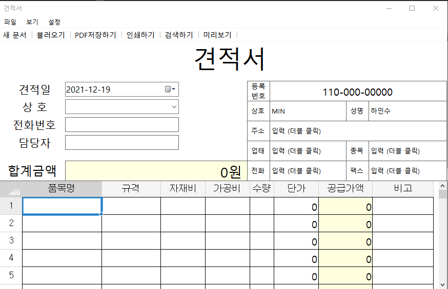
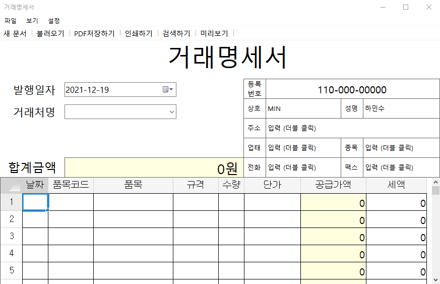
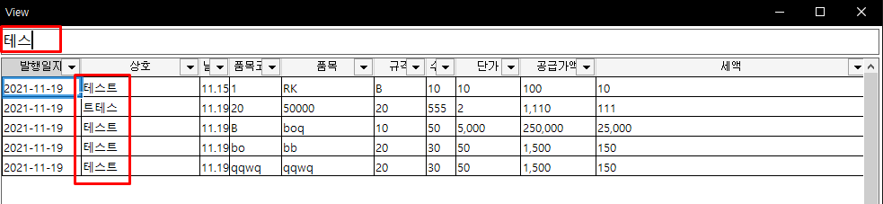

# DocV2

견적서, 거래명세서 작성 프로그램

## 주요 기능

- 견적서, 거래명세서 내역 저장 및 불러오기  // SQLite 사용
- PDF로 저장 및 인쇄  // iTextSharp 사용
- 저장된 데이터 불러오기 및 검색

## 사용법

- 첫번째 인자를 통해 견적서 또는 거래명세서 전환 사용 (실 사용 시에는 바로가기 활용)
- 첫 시작 시 save.db 저장 위치 지정 (SQLite 파일 생성)
  - [설정] - [경로 초기화] 를 통해 경로 변경 가능 (파일 이동 시 해당 경로 지정 필요)
  - PDF 저장하기 시 save.db 위치 아래에 PDF 폴더 내 자동저장
- 사용자 업체 정보 우측 상단에 작성 // (더블 클릭) 시 수정 가능

## 스크린샷

[거래명세서 전환 실행]

[검색하기 기능]